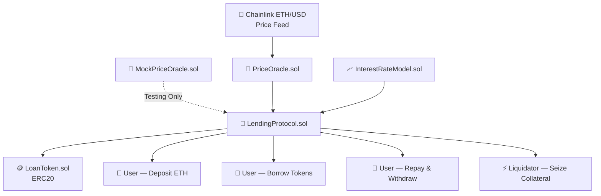
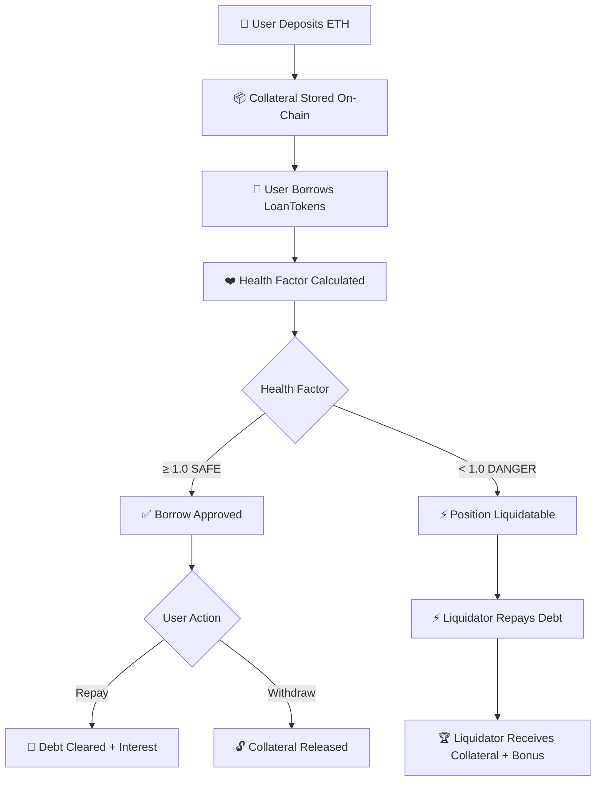

<div align="center">

# 🏦 DeFi Lending & Borrowing Protocol


<br/>


<br/>

> **A production-grade decentralized lending protocol with Chainlink price feeds, health factor enforcement, dynamic interest accrual, and on-chain liquidation.**

</div>

---

## 📑 Table of Contents

- [Overview](#-overview)
- [Project Status](#-project-status)
- [Live Deployment](#-live-deployment-sepolia)
- [Protocol Mechanics](#-protocol-mechanics)
- [Features](#-features)
- [Tech Stack](#-tech-stack)
- [Contract Architecture](#-contract-architecture)
- [Protocol Flow](#-protocol-flow)
- [Security Model](#-security-model)
- [Project Structure](#-project-structure)
- [Getting Started](#-getting-started)
- [Testing](#-testing)
- [Deployment](#-deployment)
- [Screenshots](#-screenshots)
- [What I Learned](#-what-i-learned)
- [Future Improvements](#-future-improvements)
- [Author](#-author)

---

## 📖 Overview

**DeFi Lending & Borrowing Protocol** is a decentralized finance primitive built entirely in Solidity. Users deposit ETH as collateral, borrow ERC20 LoanTokens against it, and repay with accrued interest — all governed by on-chain rules enforced through smart contracts.

The protocol integrates **Chainlink ETH/USD Price Feeds** for real-time collateral valuation, implements a **health factor system** to protect solvency, and includes a **liquidation engine** that allows external actors to close undercollateralized positions for a bonus reward.

This is not a tutorial project — it models the core mechanics of production DeFi protocols like **Aave** and **Compound**, implemented from first principles with custom CEI patterns, a dynamic interest rate model, and a Mock Oracle for isolated unit testing.

---

## 🚧 Project Status

✅ **Completed**

Fully implemented, unit tested, deployed, and interacted with on the **Ethereum Sepolia Testnet**.

---

## 🌐 Live Deployment (Sepolia)

| Contract | Address |
|---|---|
| **LoanToken** | `0xE03f8f9c81Db5c4Bc451433824bDf01ea1e8F85f` |
| **PriceOracle** | `0x9EffeBB9265b03ee4eaf6fE3ad89353e1B758e6D` |
| **InterestRateModel** | `0x4658c6f14127Cca00FE4d3C0C745954971B9D9aE` |
| **LendingProtocol** | `0x8722EF1283E3666bf59c394d4f39C44657a456F4` |

**Network:** Ethereum Sepolia Testnet

---

## ⚙️ Protocol Mechanics

### Loan-to-Value (LTV)
The protocol enforces a **75% LTV ratio** — users can borrow up to 75% of their collateral's USD value.

```
Max Borrow = (Collateral ETH × ETH/USD Price × LTV) / 100
```

### Health Factor
Each position is assigned a real-time **health factor**. A position with `healthFactor < 1` is eligible for liquidation.

```
Health Factor = (Collateral Value × Liquidation Threshold) / Total Debt
```

| Health Factor | Status |
|---|---|
| `> 1.0` | ✅ Safe |
| `= 1.0` | ⚠️ At threshold |
| `< 1.0` | ❌ Liquidatable |

### Dynamic Interest Rate
Interest accrues continuously based on time elapsed since last interaction.

```
Accrued Interest = Principal × Rate × (Δt / secondsPerYear)
```

### Liquidation Bonus
Liquidators repay a portion of a borrower's debt and receive the borrower's collateral at a **discount (bonus)** as incentive.

```
Collateral Seized = (Debt Repaid × (1 + Liquidation Bonus)) / ETH Price
```

---

## ✨ Features

| Feature | Description |
|---|---|
| 💰 Deposit ETH | Lock ETH as collateral in the protocol |
| 🏦 Borrow LoanTokens | Mint ERC20 tokens against deposited collateral |
| 💸 Repay Loans | Burn tokens and clear debt with accrued interest |
| 🔓 Withdraw Collateral | Reclaim ETH when health factor remains safe |
| 🔗 Chainlink Price Feeds | Real-time ETH/USD pricing via decentralized oracle |
| 📐 LTV Enforcement | 75% loan-to-value ceiling enforced on-chain |
| ❤️ Health Factor System | Continuous position health monitoring |
| ⚡ Liquidation Engine | Under-collateralized positions can be liquidated for a bonus |
| 📈 Dynamic Interest Model | Time-based interest accrual with utilization-driven rates |
| 🧪 Mock Oracle Testing | Isolated unit tests with a MockPriceOracle contract |
| 🌐 Sepolia Deployment | Deployed and verified on Ethereum Sepolia testnet |

---

## 🛠 Tech Stack

| Layer | Technologies |
|---|---|
| **Smart Contracts** | Solidity ^0.8.20 |
| **Development Framework** | Hardhat, TypeScript |
| **Token Standard** | ERC20 (OpenZeppelin) |
| **Oracle** | Chainlink ETH/USD Price Feed |
| **Testing** | Mocha, Chai, MockPriceOracle |
| **Web3 Library** | Ethers.js |
| **Deployment** | Hardhat Ignition, Sepolia Testnet |

---

## 🏗 Contract Architecture



### Contract Responsibilities

| Contract | Role |
|---|---|
| `LendingProtocol.sol` | Core protocol — collateral, borrowing, repayment, liquidation |
| `LoanToken.sol` | ERC20 token minted on borrow, burned on repay |
| `PriceOracle.sol` | Wraps Chainlink feed, returns ETH/USD price |
| `InterestRateModel.sol` | Computes dynamic interest rate based on utilization |
| `MockPriceOracle.sol` | Simulates price feed for deterministic unit tests |

---

## 🔄 Protocol Flow



---

## 🔒 Security Model

| Mechanism | Value | Purpose |
|---|---|---|
| Loan-to-Value (LTV) | 75% | Caps maximum borrow against collateral |
| Liquidation Threshold | 80% | Buffer before position becomes liquidatable |
| Health Factor Floor | 1.0 | Positions below are open to liquidation |
| Close Factor | 50% | Max % of debt a liquidator can repay per tx |
| Liquidation Bonus | 5–10% | Incentive for liquidators to maintain protocol health |
| Chainlink Oracle | Live feed | Tamper-resistant ETH/USD price source |
| Custom Errors | Solidity native | Gas-efficient revert messages |
| CEI Pattern | Manual | Checks-Effects-Interactions prevents reentrancy |
| OpenZeppelin ERC20 | Audited base | Battle-tested token implementation |

---

## 📁 Project Structure

```bash
lending-borrowing-protocol/
│
├── contracts/
│   ├── LendingProtocol.sol       # Core protocol logic
│   ├── LoanToken.sol             # ERC20 minted on borrow
│   ├── PriceOracle.sol           # Chainlink price feed wrapper
│   ├── InterestRateModel.sol     # Dynamic interest rate computation
│   └── MockPriceOracle.sol       # Mock oracle for unit tests
│
├── ignition/
│   └── modules/
│       └── Deploy.ts             # Hardhat Ignition deployment module
│
├── scripts/
│   └── interact.ts               # Post-deployment interaction script
│
├── test/
│   └── LendingProtocol.ts        # Full test suite with MockPriceOracle
│
├── hardhat.config.ts
├── package.json
└── .env
```

---

## 🚀 Getting Started

### Prerequisites
- Node.js (v18+)
- A Sepolia RPC URL (Alchemy / Infura)
- A funded Sepolia wallet

### Installation

```bash
git clone https://github.com/Jeevan9898/lending-borrowing-protocol.git
cd lending-borrowing-protocol
npm install
```

### Environment Variables

Create a `.env` file in the project root:

```env
SEPOLIA_RPC_URL=your_sepolia_rpc_url
PRIVATE_KEY=your_wallet_private_key
ETHERSCAN_API_KEY=your_etherscan_api_key
```

### Compile

```bash
npx hardhat compile
```

---

## 🧪 Testing

The test suite uses a **MockPriceOracle** to fully control ETH/USD pricing, allowing deterministic simulation of healthy positions, undercollateralization, and liquidation scenarios.

```bash
npx hardhat test
```

Tests cover:

- LoanToken deployment and minting
- Protocol funding
- ETH deposits and collateral accounting
- Borrowing within and beyond LTV limits
- Health factor calculation across price movements
- Time-based interest accrual
- Full repayment and collateral withdrawal
- Liquidation of undercollateralized positions
- Liquidation bonus distribution
- Mock Price Oracle integration

---

## 🌐 Deployment

### Deploy to Sepolia

```bash
npx hardhat ignition deploy ignition/modules/Deploy.ts --network sepolia
```

### Interact with Deployed Protocol

```bash
npx hardhat run scripts/interact.ts --network sepolia
```

---

## 📸 Screenshots

### Protocol Interaction — Sepolia Testnet

The interaction script runs against the live deployed contracts on Sepolia. Chainlink returns a live ETH price of **$1755.174**. The script deposits **0.03 ETH** as collateral, borrows **5.0 LT**, approves the protocol, and successfully repays — all in a single run.


---

### Final State

After the full interaction cycle — deposit, borrow, repay — the protocol reflects the final position with a healthy factor of **7.8946**, confirming the position is well-collateralized after partial interest accrual on the borrowed amount.


---

## 📚 What I Learned

- Solidity Smart Contract Development
- ERC20 Token Standards and custom minting/burning
- Chainlink Price Feed integration
- DeFi Lending Protocol Design (Aave/Compound mechanics)
- Loan-to-Value and Health Factor implementations
- Liquidation engine and bonus incentive design
- Dynamic Interest Rate Models
- Hardhat Testing with Mock Oracles
- Hardhat Ignition deployment modules
- Ethereum Sepolia Testnet deployment and interaction
- Smart Contract Security — CEI patterns, custom errors, access control

---

## 🔮 Future Improvements

- [ ] Multi-Collateral Asset Support (WBTC, stablecoins)
- [ ] Flash Loans
- [ ] Stablecoin Borrowing
- [ ] Governance Token & DAO Voting
- [ ] Supply-Side Interest Rewards (lenders earn yield)
- [ ] Aave-style Interest Index (`liquidityIndex`)
- [ ] Compound-style Utilization Curve (kink model)
- [ ] Frontend Dashboard (React + Ethers.js)
- [ ] Formal Verification (Certora / Echidna)

---

## 📄 License

This project is licensed under the **MIT License**.

---

## 👤 Author

**Jeevan Yadav**

[](https://jeevan-yadav.vercel.app/)
[](https://github.com/Jeevan9898)
[](https://www.linkedin.com/in/jeevan-yadav-b664952b5)

---

<div align="center">

**⭐ If this project helped you understand DeFi protocol design, consider giving it a star.**

</div>
